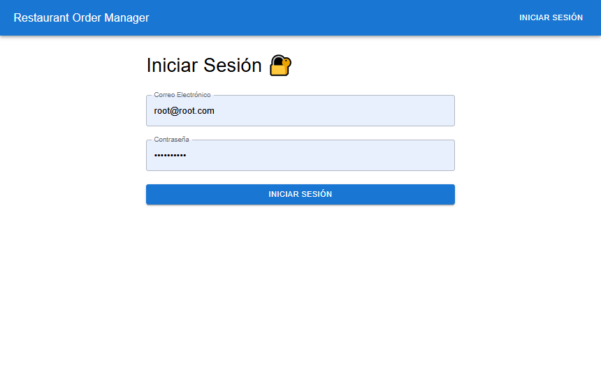
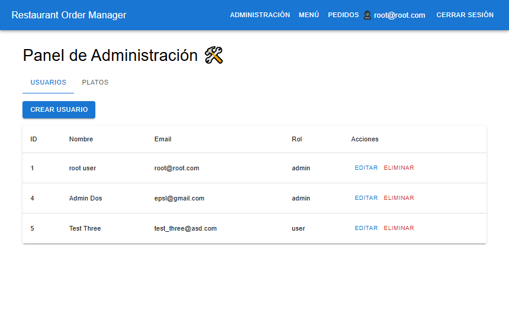
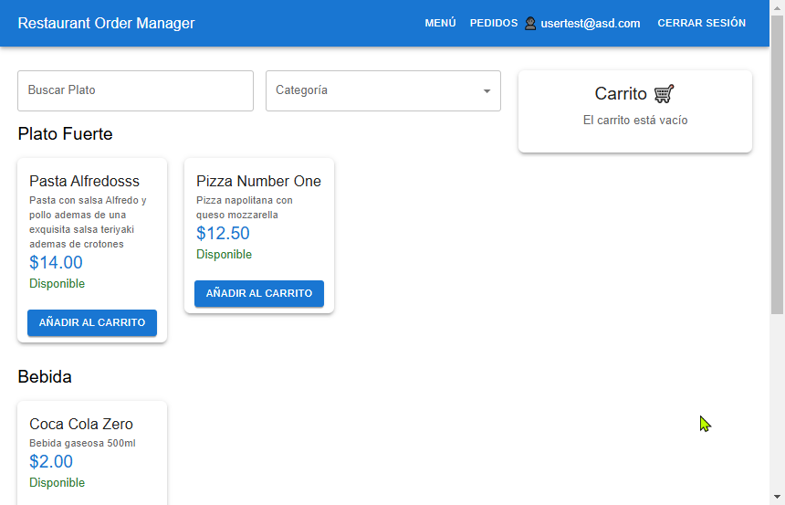

# Restaurant Order Manager

This is a Full Stack project simulating order and menu management in a restaurant. It uses Node.js, Express, Sequelize, MySQL in the backend, and React with Material UI in the frontend.

## Technologies Used

### Backend:
- Node.js
- Express
- Sequelize
- MySQL
- JWT (Authentication)
- CORS

### Frontend:
- React
- Axios
- Material UI (MUI)
- React Router

## Project Structure

```
restaurant-order-manager/
│
├── backend/
│   ├── models/           # Sequelize Models
│   ├── routes/           # Express Routes
│   ├── controllers/      # Controllers
│   ├── services/         # Business Logic
│   ├── middlewares/      # Middlewares (JWT, CORS)
│   ├── config/           # Database Configuration
│   ├── .env              # Environment Variables (MySQL & JWT credentials)
│   ├── server.js         # Backend Entry Point
│   └── package.json      # Backend Dependencies
│
├── restaurant-order-frontend/
│   ├── src/
│   │   ├── components/   # Reusable Components
│   │   ├── context/      # Context API (UserContext, CartContext)
│   │   ├── pages/        # Application Pages
│   │   ├── api/          # Axios Configuration
│   │   ├── routes/       # Public and Private Routes
│   │   ├── App.js        # Main Component
│   │   ├── index.js      # React Entry Point
│   ├── public/           # Static Files
│   ├── .env              # Frontend Environment Variables
│   ├── package.json      # Frontend Dependencies
│   └── README.md         # Frontend Documentation
```

## Features Implemented

### Backend:
- CRUD for Menu (`/menu`): Create, read, update, and delete dishes (Logical Deletion).
- CRUD for Orders (`/orders`): Create, read, update status, and delete orders.
- Order Statuses: `created`, `preparing`, `delivered`, `cancelled`.
- `Order -> OrderItem -> MenuItem` relationship with Sequelize.
- User Registration and Login (`/users`).
- Role-based Access Control (Admin/User).
- JWT Authentication and Protected Routes.
- Roles Table and Role Assignment to Users.

### Frontend:
- Display Menu with Material UI.
- Add Items to Cart and Place Orders.
- View and Update Order Status with visual feedback.
- User Registration and Login with JWT handling.
- Admin Section for Managing Users and Menu.
- Logical Deletion for Menu Items.
- Snackbar Notifications and Loading Spinners for UX.
- React Router for Page Navigation.
- Context API for User and Cart State Management.

## Installation

### Backend:
1. Clone the repository.
2. Navigate to `backend/`.
3. Install dependencies:
   ```bash
   npm install
   ```
4. Create a `.env` file with your MySQL and JWT credentials:
   ```ini
   DB_HOST=localhost
   DB_USER=root
   DB_PASSWORD=your_password
   DB_NAME=restaurant_manager
   JWT_KEY=super_secret_key
   ```
5. Execute sql script:
   ```sql
   creation.sql
   ```
6. Start Backend:
   ```bash
   npm run dev
   ```

### Frontend:
1. Navigate to `restaurant-order-frontend/`.
2. Install dependencies:
   ```bash
   npm install
   ```
3. Create a `.env` file with the backend URL:
   ```ini
   REACT_APP_API_URL=http://localhost:3000
   ```
4. Start React App:
   ```bash
   npm start
   ```

## Backend Endpoints

### Menu
- `GET /menu`
- `POST /menu` (Admin)
- `PUT /menu/:id` (Admin)
- `DELETE /menu/:id` (Logical Delete - Admin)

### Orders
- `GET /orders` (Authenticated)
- `POST /orders` (Authenticated)
- `PUT /orders/:id/status` (Admin)

### Users
- `GET /users` (Admin)
- `POST /users/register`
- `POST /users/login`
- `PUT /users/:id` (Admin)
- `DELETE /users/:id` (Admin)

### Roles
- `GET /roles` (Admin)


## Methodology explication
- [Explanation in Spanish](./assets/explication-spanish.md)
- [Explanation in English](./assets/explication-english.md)

## Screenshots
### Página Principal


### Vista de administrador


### Vista de usuario


## Authors
- Erwing Solorzano
